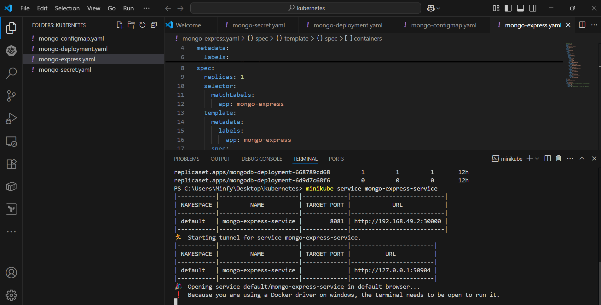
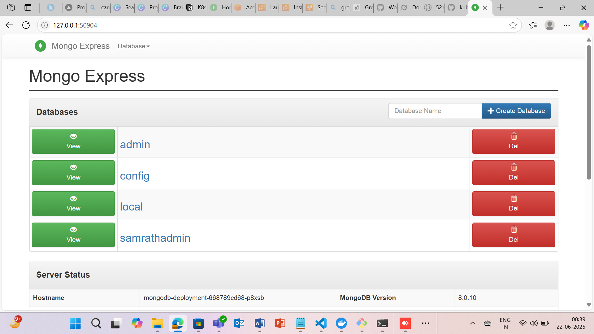

# kubernetes
# Web application on kubernets
In this application we have mongodb , mongo-express , secrets , services , configmaps
firstly we need to start the minikube 
# minikube start
 
then create secure credentials
# kubectl apply -f mongo-secret.yaml
to check the credentials
# kubectl get secrets

 
 
then deploy the mongo-db backend by 
# kubectl apply -f mongo-deployment.yaml
to view all the resources 
# kubectl get all

 
 
then create the configmap for the non senstivite data
# kubectl apply -f mongo-configmap.yaml
to view the configmaps 
# kubectl get configmaps

 
 
then create the mongo-express for the frontend admin interface
# kubectl apply -f mongo-express.yaml

 
 
then brower will display the logging option to access the mongodb 
then enter the user name as my-admin-user
and password as my-super-password 

 
then we can access the mongodb interface and we can create a database and also we can delete 

 
 
to clean up all the resources 
kubectl delete -f mongo-express.yaml
kubectl delete -f mongo-deployment.yaml
kubectl delete -f mongo-configmap.yaml
kubectl delete -f mongo-secret.yaml