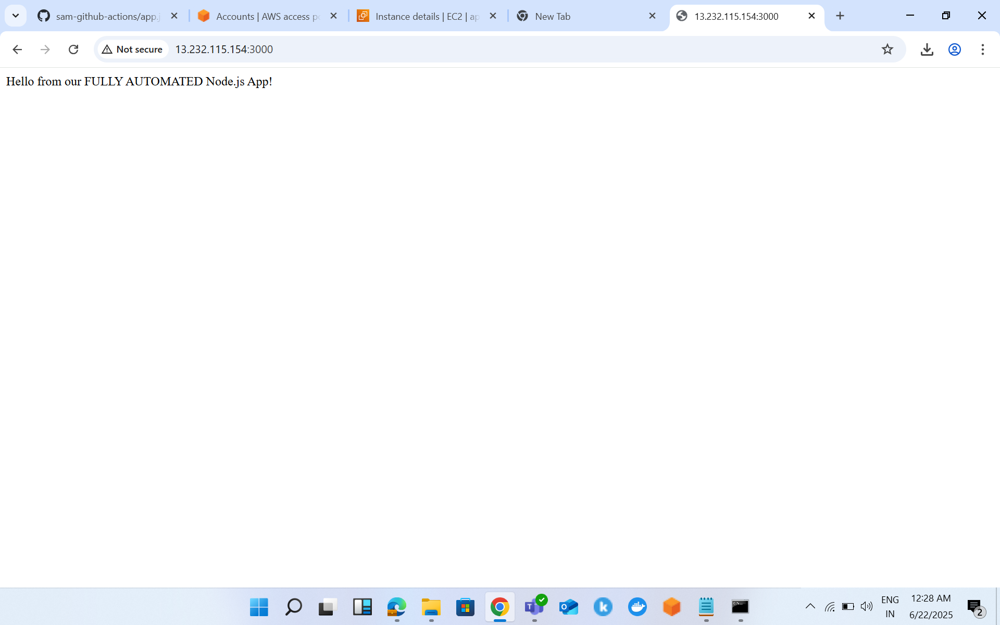

# GITHUB WORKFLOW TAKE HOME ASSIGNMENT 
In this assignment we are making a pipeline to automate the running and installation of docker inside our EC2 instance
and also the creating and building image and running the container 
firstly we need to create a docke hub image 
and create a new access token or password 
After this creation of access token we need to create a github repo with "sam-github-actions" 
then upload all files app.js , package.json 
then run the 
 

create a security group which allow port 22 and 3000 in bound traffic and ec2 instance type is t2.micro
then after all running we will see the public ip as "13.232.115.154" 

then ssh into our instance to download docker to run our image via pipeline
# ssh -i Samrath-kp.pem ec2-user@13.232.115.154

then copy the public ip and add the port 3000 to the public ip is runnig or not 
http://13.232.115.154:3000/

